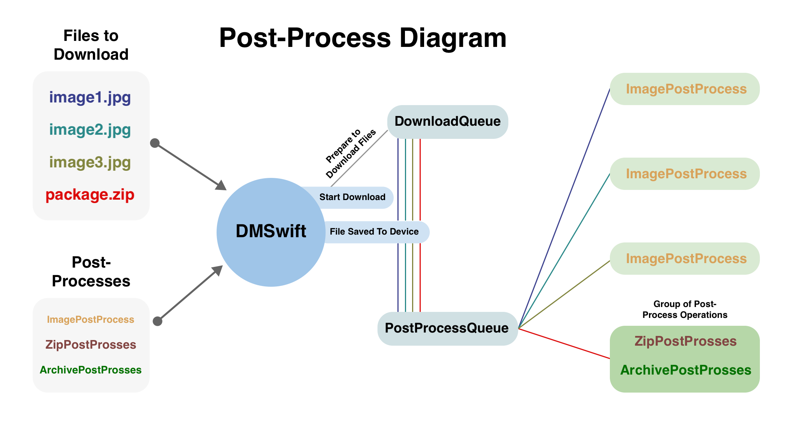

# How Post-process works

## Overview

`DMSwift` may have several post-processes. </br> 
Post-processing can only be assigned during the initialization of `DMSwift`. During initialization, `DMSwift` initializes the` PostProcessQueue` with a list of post-processes. </br> 
With each successfully downloaded file, `PostProcessQueue` starts post-processing one by one. </br>
During post-processing, the downloaded file is checked for the file extension, if post-processing can process this file, post-processing will then start. Over one file, several post-processing operations can be carried out in turn.

<a href="../Images/post_process_diagram.png" target="_blank"></a>

## How To Create PostProcessing

To create you need to go through 4 basic steps:

1. Create your `struct` object that will be inherited from the `PostProcessing` protocol
2. Specify supported file resolution
3. Implement actions while receiving data for post-processing in the `prepare` method
4. Implement the post-processing process in the `process` method
5. Call `onComplete` after post-process is complete.

### Example

Let's say you want to create post-processing for unzipping a file:

``` swift
public struct ZipProcessing: PostProcessing {

}
```

First you need to specify which file extension your post-processing will process:

``` swift
public struct ZipProcessing: PostProcessing {
	public var supportedFileExtensions: Set<String> = ["zip"]
}
```

Implement actions while receiving data for post-processing in the `prepare` method:

``` swift
public struct ZipProcessing: PostProcessing {
    private var sourceLocation: URL?
    private var fileManager: FileStorageManager?

    public mutating func prepare(fileManager: FileStorageManager?, filename: String?, fileExtention: String?, sourceLocation: URL?) {
        self.fileManager = fileManager
        self.sourceLocation = sourceLocation
    }
}
```

Implement the post-processing process in the `process` method:

``` swift
public struct ZipProcessing: PostProcessing {
    private var sourceLocation: URL?
    private var fileManager: FileStorageManager?

    public func process() {
        guard let fileManager = fileManager else { return }
        guard let sourceLocation = sourceLocation else { return }
        guard let directoryUrl = fileManager.directoryURL else { return }
			// process logic
			…
			try? fileManager.fileManager.unzipItem(at: sourceLocation, to: directoryUrl, progress: progress)
    }
}
```

Call `onComplete` after post-process is complete:


``` swift
public struct ZipProcessing: PostProcessing {
    private var sourceLocation: URL?
    private var fileManager: FileStorageManager?

    public func process() {
			var error: Error? = nil
			// process logic
			…
			onComplete?(error)
    }
}
```